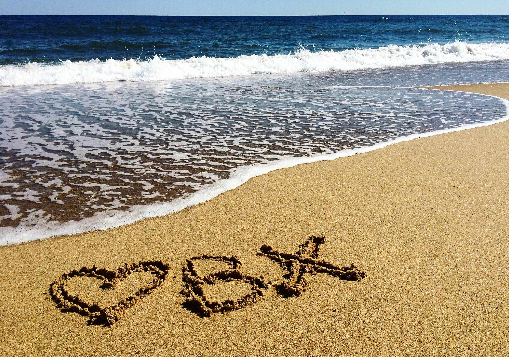

## I don't know about you, but I don't see my friends or family nearly enough. 



What are you doing the last week of July, 2021? So this beach house idea is just an 
effort to get just a little more friends and family into our lives.

Nags Head is the center of the action in the Outer Banks (OBX). So the plan is to rent a 
beach house there. If there is a lot of interest we can rent a bigger house or perhaps even 
more than one house.

Well I would love for you to join me in the Outer Banks of North Carolina, a place I have 
visited and loved many a summer.

If you are unfamiliar with the amazing Outer Banks, you can find more information 
[here](https://en.wikipedia.org/wiki/Outer_Banks).

- **Date: July 24 - 31, 2021**
- **Location: Nags Head, North Carolina**
- **Cost: approximately $2,500 per room, depending on the exact place that is chosen**

qq
- Jonathan

You can use the [editor on 
GitHub](https://github.com/jonathan-r-jones/Outer-Banks-2021/edit/gh-pages/index.md) to 
maintain and preview the content for your website in Markdown files.

Whenever you commit to this repository, GitHub Pages will run [Jekyll](https://jekyllrb.com/) 
to rebuild the pages in your site, from the content in your Markdown files.

### Markdown

Markdown is a lightweight and easy-to-use syntax for styling your writing. It includes 
conventions for

```markdown
Syntax highlighted code block

# Header 1
## Header 2
### Header 3

- Bulleted
- List

1. Numbered
2. List

**Bold** and _Italic_ and `Code` text

[Link](url) and 
```

For more details see [GitHub Flavored Markdown](https://guides.github.com/features/mastering-markdown/).

### Jekyll Themes

Your Pages site will use the layout and styles from the Jekyll theme you have selected in your [repository settings](https://github.com/jonathan-r-jones/Outer-Banks-2021/settings). The name of this theme is saved in the Jekyll `_config.yml` configuration file.

### Support or Contact

Having trouble with Pages? Check out our [documentation](https://docs.github.com/categories/github-pages-basics/) or [contact support](https://github.com/contact) and we’ll help you sort it out.
